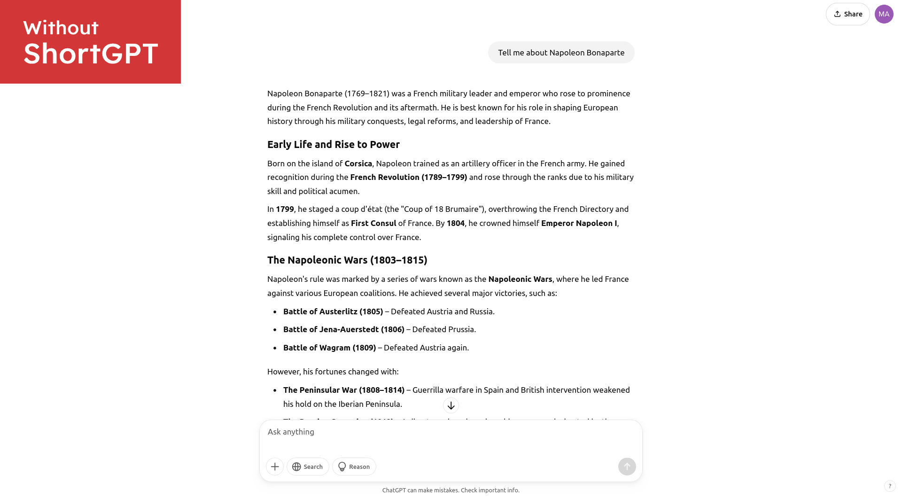
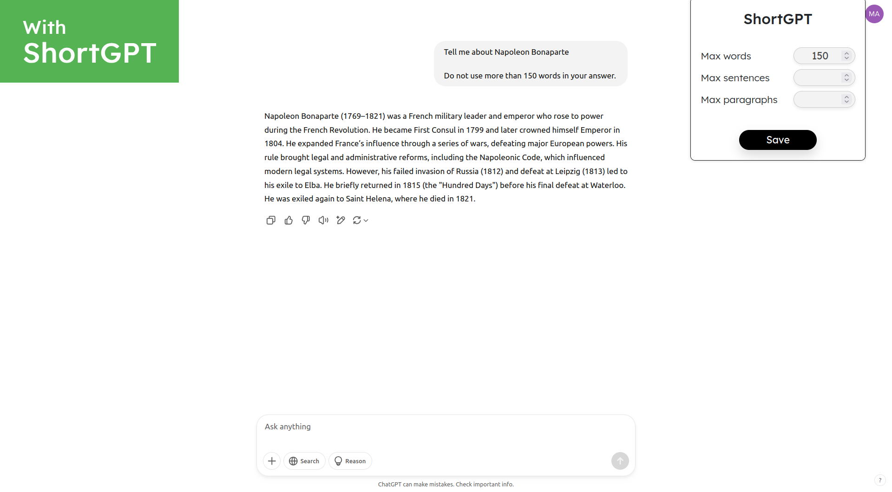

# ShortGPT
ShortGPT is a browser extension that makes ChatGPT's answers shorter. Easily customize ChatGPT's answers to have a maximum number of words, sentences and paragraphs!

## Functioning
ShortGPT extends your prompts with predefined sentences that instruct ChatGPT to respect some length limits when answering. You can easily set your desired limits in the extension's popup.

## Contributing

Contributions are welcome! Please open an issue or submit a pull request for any improvements or bug fixes.

---

Enjoy a more focused ChatGPT's experience with ShortGPT!